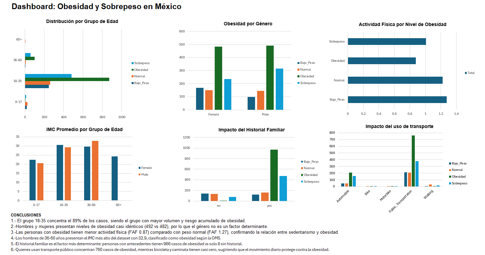

# Análisis de Obesidad y Sobrepeso en México, Colombia y Perú

## Descripción
Este proyecto analiza los principales factores de riesgo asociados a la obesidad y el sobrepeso en población de México, Colombia y Perú. A través de limpieza de datos, análisis exploratorio y visualización en Excel, se identificaron patrones clave que pueden orientar estrategias de salud pública.

## Contexto
La obesidad representa uno de los mayores desafíos de salud pública en Latinoamérica. Según la OMS, más del 50% de la población adulta en México presenta sobrepeso u obesidad, siendo una de las principales causas de diabetes, enfermedades cardiovasculares y muerte prematura. Entender sus factores de riesgo es clave para la prevención.

## Dataset
- **Fuente:** [Kaggle - Obesity or CVD Risk Dataset](https://www.kaggle.com/datasets/aravindpcoder/obesity-or-cvd-risk-classifyregressorcluster)
- **Autor:** AravindPCoder
- **Países:** México, Colombia y Perú
- **Registros:** 2,087 (después de limpieza de 24 duplicados)
- **Variables originales:** 17 columnas
- **Variables calculadas:** IMC, Categoría IMC, Grupo de Edad

## Estructura del archivo Excel
- **Proyecto 1** → Datos limpios con columnas calculadas
- **Análisis 1 al 7** → Tablas dinámicas por grupo de edad, género, historial familiar, actividad física, transporte y alimentación
- **Dashboard** → Visualización final con 6 gráficas y conclusiones

## Herramientas
- Microsoft Excel — limpieza, análisis exploratorio y dashboard

## Preguntas de Análisis
1. ¿Qué grupo de edad tiene mayor riesgo de obesidad?
2. ¿Existe diferencia significativa entre hombres y mujeres?
3. ¿El historial familiar influye en el nivel de obesidad?
4. ¿Las personas con obesidad hacen menos actividad física?
5. ¿El tipo de transporte se relaciona con la obesidad?
6. ¿Quienes consumen comida calórica tienen mayor IMC?

## Hallazgos Principales
1. El grupo **18-35 años** concentra el **89%** de los casos — es el grupo con mayor riesgo acumulado
2. El **historial familiar** es el factor más determinante: personas con antecedentes tienen **966 casos de obesidad vs solo 8** sin historial
3. Los **hombres de 36-60 años** presentan el IMC más alto: **32.9** — clasificado como obesidad según la OMS
4. Las personas con obesidad tienen **menor actividad física** (FAF promedio: 0.87 vs 1.27 en peso normal)
5. Quienes consumen comida calórica tienen un IMC promedio de **30.5 vs 24.3** sin consumo
6. El **transporte público** concentra 760 casos de obesidad; bicicleta y caminata tienen casi cero

## Interpretación Médico-Social
Los datos revelan un patrón preocupante pero prevenible. La obesidad en esta población no es un problema aislado sino el resultado de una combinación de factores genéticos, conductuales y sociales.

**Factor genético:** El historial familiar es el predictor más poderoso del dataset. Esto sugiere una predisposición genética significativa, lo que implica que las intervenciones preventivas deben comenzar desde la infancia en familias con antecedentes.

**Factor conductual:** La baja actividad física y el consumo de alimentos calóricos están directamente asociados con niveles más altos de IMC. Esto refleja un estilo de vida sedentario que puede modificarse con educación y acceso a espacios deportivos.

**Factor social:** El uso del transporte público como principal medio de movilidad concentra la mayor cantidad de casos de obesidad. Esto no significa que el transporte cause obesidad, sino que refleja una realidad socioeconómica — las personas que dependen del transporte público tienen menos tiempo, recursos y acceso a alimentación saludable y ejercicio.

**Población en riesgo:** El grupo 18-35 años es el más vulnerable en términos de volumen. Intervenir en este grupo con programas de salud preventiva tendría el mayor impacto poblacional.

**Conclusión general:** La obesidad en Latinoamérica es un problema multifactorial donde los determinantes sociales de la salud juegan un papel tan importante como los factores individuales. Los datos sugieren que las políticas públicas más efectivas serían aquellas que combinen educación nutricional, acceso a actividad física y atención especial a familias con historial de obesidad.

## Cómo Replicar este Análisis
1. Descarga el dataset original desde el link en la sección Dataset
2. Abre el archivo en Excel y elimina filas duplicadas (Datos → Quitar duplicados)
3. Crea las columnas calculadas:
   - **Grupo Edad:** `=SI(B2<=17,"0-17",SI(B2<=35,"18-35",SI(B2<=60,"36-60","60+")))`
   - **IMC:** `=Peso/(Altura*Altura)`
   - **Categoría IMC:** `=SI(IMC<18.5,"Bajo_Peso",SI(IMC<25,"Normal",SI(IMC<30,"Sobrepeso","Obesidad")))`
4. Genera tablas dinámicas cruzando Grupo Edad, Género, Categoría IMC y demás variables de interés
5. Crea gráficos dinámicos a partir de cada tabla
6. Organiza los gráficos en una hoja de Dashboard con conclusiones basadas en los datos

## Dashboard

